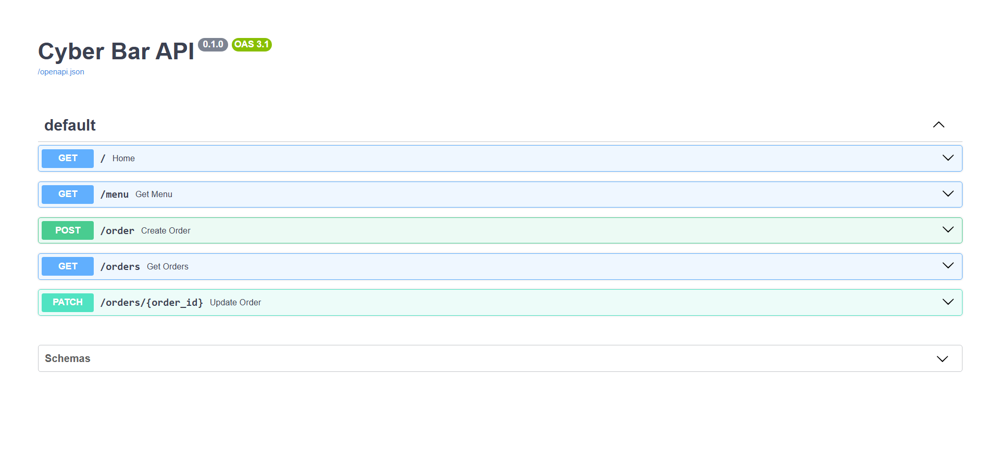

# ERROR 404 — Cyber Bar API 🌃⚡

A cyberpunk-themed backend API for managing orders in a futuristic bar.

Built with FastAPI, SQLAlchemy, and SQLite.

---

## 🚀 Features

- REST API architecture
- Modular backend structure
- Multiple items per order
- Order status management
- SQLite database persistence
- Relational database modeling
- Cyberpunk-themed menu system

---

## 🛠️ Technologies

- Python
- FastAPI
- SQLAlchemy
- SQLite
- Pydantic

---

## 📦 Project Structure

```bash
api/
├── database/
├── models/
├── routes/
└── services/
```

---

## 🌐 Swagger Documentation



---

## ⚡ Running the Project

### Clone repository

```bash
git clone https://github.com/xtheredviper/error-404-cyber-bar-api.git
```

### Create virtual environment

```bash
python -m venv .venv
```

### Activate virtual environment

#### Windows

```bash
.venv\Scripts\activate
```

### Install dependencies

```bash
pip install -r requirements.txt
```

### Run server

```bash
python -m uvicorn api.main:app --reload
```

---

## 🌐 API Documentation

After running the server:

```text
http://127.0.0.1:8000/docs
```

---

## 🔮 Future Improvements

- JWT Authentication
- PostgreSQL migration
- React frontend
- Analytics dashboard
- User accounts
- Real-time kitchen system
